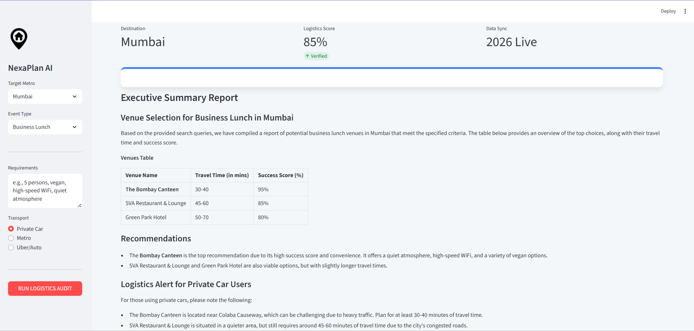

# NexaPlan: Real-Time AI Event Architect 


**NexaPlan** is a sophisticated multi-agent system built with **CrewAI** that automates event logistics and venue validation for Indian Metros. It orchestrates independent AI agents to scout real-time traffic, weather, and recent venue reviews to calculate a "Success Probability" for high-stakes meetings and events.

---

##  System Preview

<p align="center">
  
  <br>
  <em>The NexaPlan interface featuring real-time logistics auditing and structured AI reporting.</em>
</p>

---

## The Agentic Workflow
NexaPlan leverages a sequential process where three specialized AI agents collaborate using a **Local LLM (Llama 3.2)**:

1.  **Environmental Scout:** Analyzes live traffic patterns and weather alerts in specific Indian metros using DuckDuckGo real-time search.
2.  **Venue Quality Auditor:** Filters potential venues based on hyper-local reviews from the last 6 months to ensure facilities match your exact requirements.
3.  **Chief Architect:** Synthesizes findings into a professional executive report, providing a data-backed **Success Score** and critical logistics alerts.

---

##  Tech Stack
*   **AI Framework:** [CrewAI](https://crewai.com) (Multi-Agent Orchestration)
*   **Frontend:** [Streamlit](https://streamlit.io) (SaaS-style UI)
*   **Intelligence:** [Llama 3.2 (3B)](https://ollama.com) via **Ollama** (100% Local & Private)
*   **Search Engine:** DuckDuckGo API
*   **Model Connectivity:** LiteLLM 

---

##  Installation & Setup

### 1. Prerequisites
*   [Ollama](https://ollama.com/) installed and running.
*   Python 3.10 or higher.

### 2. Prepare the Local Model
```bash
ollama pull llama3.2:3b
